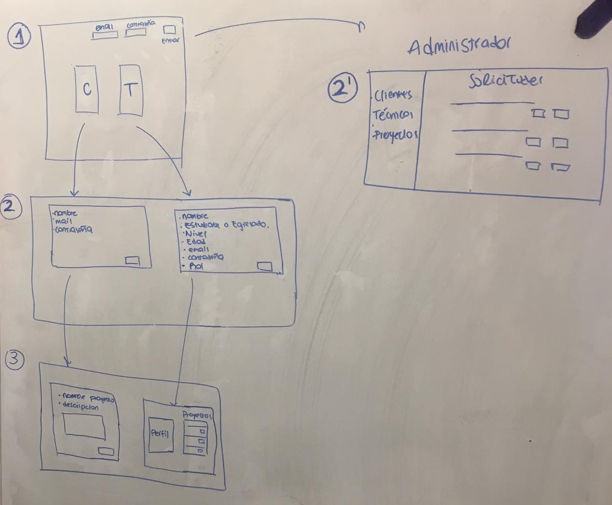
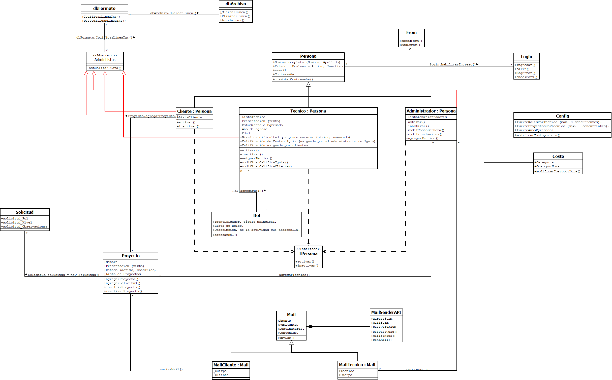

# PROGRAMACIÓN 2 - 2019

### EQUIPO 5: Sofía Nicoletti, Fausto Pieruzzi, Angel Matías Rodriguez, Marcelo Stabile.

# INTRODUCCIÓN

### El Centro Ignis cumple el rol de facilitador de técnicos calificados para proyectos, siendo un intermediario entre el cliente que tiene un proyecto y los técnicos que se registran para trabajar. Para desarrollar estas funciones, necesita una aplicación que permita la administración de recursos humanos para proyectos. Esta aplicación debe ser una mejora significativa al método que actualmente utilizan, basado en el uso de planillas Excel y correos electrónicos.

### Los estudiantes de la UCU que presentan proyectos, los consideraremos clientes en adelante, a futuro podría ampliarse el servicio para egresados. El cliente se contacta con el Centro Ignis presentando su proyecto ya que la Universidad debe estar al tanto de todos.
### Además de registrar los proyectos, los clientes deben solicitar expresamente los técnicos que necesita.

### Los técnicos, son estudiantes de la UCU que se registran en el centro para trabajar. Pueden anotarse hasta en 3 roles (hay 22 disponibles). Pueden ser de cualquier año de la carrera, serán catalogados según "niveles de dificultad".
### Podrán estar trabajando hasta un máximo de 3 proyectos concurrentes.

### Al final del proyecto, el centro debe calcular las horas empleadas por el técnico e informar al cliente  cuanto debe pagar.

# LA APLICACIÓN

### Cuando el usuario se loguea en la aplicación podrá hacerlo con tres perfiles diferentes, cliente, técnico o administrador.
### Los técnicos deberán ingresar sus datos personales e indicar en que roles están dispuestos a brindar su asesoramiento.
### Los clientes podrán postular sus proyectos y solicitar que tipo de técnico necesita.
### Los administradores, autorizarán a técnicos y clientes, analizarán los proyectos presentados, asignarán los técnicos a cada proyecto y calcularán las horas trabajadas y los honorarios del mismo.

## MANUAL DE USUARIO

### Al ingresar a la pantalla principal de la aplicación, deberá loguearse en el botón Entrar, ingresando su mail y contraseña, en caso de no tener usuario creado debe registrarse, ingresando a los botones, de cliente o técnico, según corresponda.

### Para registrarse como cliente, debe ingresar, nombre, mail y contraseña.

### Para registrarse como técnico debe ingresar sus datos personales y seleccionando los roles a los cuales se postula. Cada rol implica una disciplina (sonidista, músico, etc.). Podrá postularse hasta un máximo de 3 roles, pudiendo cambiar los mismos más adelante, aunque siempre conservando la limitación de 3.

### Cuando un usuario registrado como técnico se loguee, podrá acceder al MENÚ DE TECNICOS y podrá ver los proyectos que están activos dentro de los roles indicados al registrarse y podrá postularce a cualquiera de ellos.

### Cuando un usuario registrado como cliente se loguee, podra acceder al MENÚ DE CLIENTES y podrá postular su proyecto, para esto debe ingresar: nombre del proyecto y una descripción.

### Cuando un usuario registrado como administrador se loguee, podrá acceder al MENÚ DE ADMINISTRADOR y podrá activar o desactivar clientes y técnicos que se han registrado en la aplicación.
### Verá los proyectos presentados de cada cliente y los técnicos postulados a dicho proyecto, debiendo hacer la asignación final.
### Ingresará la cantidad de horas informadas por los técnicos dedicadas a cada proyecto.
### Realizará la liquidación de horas, empleadas por cada técnico en cada proyecto y se informará al cliente los honorarios a pagar al técnico.

## POSTER DE LA APLICACIÓN

### Abrir el archivo Poster.jpg ubicado en la misma carpeta donde se encuentra el documento.

## MENÚ DE CLIENTES

### Estará en condiciones de ingresar proyectos a su cuenta de cliente.
### Para dar de alta un proyecto, debe ingresar un nombre de proyecto y una descripción (a modo de presentación).
### Luego de creado el proyecto, el cliente podrá dar de alta una o más solicitudes de técnicos. Deberá ingresar una solicitud por cada técnico que necesita. Un proyecto podrá tener "n" solicitudes de técnicos, por el momento no hay una limitación establecida por el Centro Ignis.

## MENÚ DE TÉCNICOS

### Ingresará cuando quiera visualizar a qué proyecto está asignado y también a controlar las horas que viene desarrollando en cada uno.

### Es de interés para el Centro Ignis de brindar al técnico un historial de sus trabajos, ya que puede servirle como referencia laboral. Por lo tanto, el técnico contará con la opción de descargar un documento que detalle los trabajos que realizó (nombre de los proyectos, el rol que desempeño en cada uno y las horas en cada uno).

### Debido a que el técnico recibe un pago por sus servicios, la aplicación también debe permitirle descargar un documento con las horas realizadas por proyecto y el pago que debe recibir por cada uno. Esto también le permite al Centro Ignis de alivianar su trabajo administrativo, ya que en todo momento el técnico puede revisar lo que tiene que cobrar sin necesidad de depender del administrador del centro.

## MENÚ DE ADMINISTRADOR DEL CENTRO IGNIS

### El administrador del Centro Ignis accede a la aplicación y tendrá opciones para visualizar la siguiente información:
* Lista de clientes registrados (pudiendo ver información detallada de cada uno).
* Lista de técnicos registrados (pudiendo ver información detallada de cada uno).
* Lista de proyectos (activos, concluidos).
* Lista de solicitudes por proyecto (activas en cada proyecto activo).
* Lista de costo / hora dependiendo de cada categoría.

### El administrador podrá realizar las siguientes acciones:
* Activar / desactivar clientes (no se borra para preservar sus datos históricos).
* Activar / desactivar técnicos (no se borra para preservar sus datos históricos).
* Asignar uno o más técnicos a cada proyecto.
* Modificar el costo / hora.
* Modificar el límite de roles por técnico.
* Modificar el límite de proyectos en los que puede estar asignado un técnico.

### Es necesario obtener la siguiente información en reportes:
* Lista de proyectos activos, indicando el cliente en cada caso.
* Lista de horas a pagar por técnico.

## REQUISITOS DE LA APP

* Mantener una base de datos de:
    * clientes.
    * técnicos.
    * proyectos.
    * solicitudes.

* Permitir a los clientes:
    * registrar sus proyectos.
    * registrar solicitudes por los técnicos que necesita.

* Permitir a los técnicos:
    * registrarse como técnico.
    * postularse hasta un máximo de 3 roles.

* Permitir al operador de Ignis:
    * asignar técnicos a los proyectos a partir de las solicitudes.
    * mantener un registro de costo por hora.

* Ignis debe poder contar con la siguiente información:
    * informe de un cliente y sus proyectos y técnicos asignados.
    * informe de proyectos activos y concluidos.
    * informe de técnicos activos e inactivos.
    * informe de técnicos y sus proyectos realizados.

* Fronts:
    * front para clientes
    * front para técnicos
    * front para Ignis (administradores)

## CLASE "PERSONA"

### Esta clase implementa el constructor de una persona. Por herencia, las clases Cliente, Técnico y Administrador implementarán estos atributos y métodos.

### EXPERT, consideramos que esta clase es experta en establecer el constructor de un objeto persona, no hay otra clase para esta función.
### SRP, cumple con este principio puesto que es su única responsabilidad y solo cambia si hay cambios en el constructor o se agregan métodos.

* Atributos:
    * Nombre completo (Nombre, Apellido)
    * Estado (Activo, Inactivo)
    * e-mail
    * Contraseña

* Comportamientos:
    * cambiarContraseña()

* Colaboraciones:
    * Cliente
    * Tecnico
    * Administrador

* Tests asociados a esta clase:
    * Se puede crear un test sobre la construccion de una persona.

## CLASE "CLIENTE" : PERSONA

### Esta clase implementa el constructor de un cliente. Hereda de Persona algunos atributos y métodos.
### Además contiene una lista de clientes, la cual se actualiza al inicio de la aplicación y cuando hay altas de clientes.

### EXPERT, consideramos que esta clase es experta en establecer el constructor de un objeto cliente, no hay otra clase para esta función.
### Tampoco hay otra clase que mantenga la lista de clientes.
### SRP, cumple con este principio puesto que es su única responsabilidad y solo cambia si hay cambios en el constructor o se agregan atributos o métodos.

* Atributos:
    * ListaClientes

* Hereda de PERSONA los siguientes atributos:
    * Nombre completo (nombre y apellido)
    * Estado (activo, inactivo)
    * e-mail
    * Contraseña

* Comportamientos:
    * Constructor del cliente.
    * activar()    método para activar un cliente.
    * inactivar()    método para inactivar un cliente y sus solicitudes y proyectos asociados.

* Colaboraciones:
    * Persona
    * Proyecto

* Tests asociados a esta clase:
    * Es importante controlar que no se ingrese nulo el nombre, el apellido o el email.
    * Si el nombre y el apellido se ingresan en distintos atributos, es importante que al concatenarlos se controle que no existan "espacios" innecesarios entre ellos.

* Implementa:
    * AdminLista, para el método de actualizarLista().

## CLASE "TECNICO" : PERSONA

### Esta clase implementa el constructor de un técnico. Hereda de Persona algunos atributos y métodos.
### Además contiene una lista de técnicos, la cual se actualiza al inicio de la aplicación y cuando hay altas.

### EXPERT, consideramos que esta clase es experta en establecer el constructor de un objeto técnico, no hay otra clase para esta función.
### Tampoco hay otra clase que mantenga la lista de técnicos.
### SRP, cumple con este principio puesto que es su única responsabilidad y solo cambia si hay cambios en el constructor o se agregan atributos o métodos.

* Atributos:
    * Presentación (texto)
    * Estudiante o Egresado
    * Año de egreso
    * Edad
    * Nivel de dificultad que puede encarar (básico, avanzado)
    * Calificación de Centro Ignis (asignada por el administrador de Ignis)
    * Calificación asignada por clientes.
    * ListaTecnicos

* Hereda de PERSONA los siguientes atributos:
    * Nombre completo (nombre y apellido)
    * Estado (activo, inactivo)
    * e-mail
    * Contraseña

* Comportamientos:
    * Constructor del técnico.
    * activar()      método para activar un técnico.
    * inactivar()    método para inactivar un técnico.
    * asignarTecnico()  asignar tecnico a uno o mas proyectos.
    * modificarCalificaIgnis()     método para modificar la calificación realizada por Ignis
    * modificarCalificaCliente()   método para modificar la calificación realizada por Clientes

* Colaboraciones:
    * Persona
    * Proyecto

* Tests asociados a esta clase:
    * Es importante controlar que no se ingrese nulo el nombre, el apellido, la edad o el email.
    * Si el nombre y el apellido se ingresan en distintos atributos, es importante que al concatenarlos se controle que no existan "espacios" innecesarios entre ellos.
    * Es necesario controlar que exista un método para controlar que el año de egreso no sea menor a cero (o un valor razonable, ejemplo 2015) y que además el valor ingresado tampoco puede ser mayor al año en curso.
    * Es necesario hacer un test sobre los métodos que modifican las calificaciones de clientes y del centro ya que los mismos deben controlar que los valores se encuentran dentro de los rangos establecidos previamente (ejemplo, entre 0 y 5).

* Implementa:
    * AdminLista, para el método de actualizarLista().

## CLASE "ADMINISTRADOR" : PERSONA

### Esta clase implementa el constructor de un Administrador. Hereda de Persona algunos atributos y métodos.
### Además contiene una lista de Administradores, la cual se actualiza al inicio de la aplicación y cuando hay altas.

### EXPERT, consideramos que esta clase es experta en establecer el constructor de un objeto Administrador, no hay otra clase para esta función.
### Tampoco hay otra clase que mantenga la lista de Administradores.
### SRP, cumple con este principio puesto que es su única responsabilidad y solo cambia si hay cambios en el constructor o se agregan atributos o métodos.

* Atributos:
    * ListaAdministradores

* Hereda de PERSONA los siguientes atributos:
    * Nombre completo (nombre y apellido)
    * Edad
    * Estado (activo, inactivo)
    * e-mail
    * Contraseña

* Comportamientos:
    * constructor del administrador.
    * modifCostoPorHora() modificar el precio por hora de los proyectos.
    * modificarLimites() modificar limites de roles o proyectos.
    * agregarTecnico() Agrega tecnico a un proyecto.

* Colaboraciones:
    * Persona
    * Proyecto
    * Rol
    * Config
    * Solicitud

* Tests asociados a esta clase:
    * Es importante controlar que no se ingrese nulo el nombre, el apellido o el email.
    * Si el nombre y el apellido se ingresan en distintos atributos, es importante que al concatenarlos se controle que no existan "espacios" innecesarios entre ellos.

* Implementa:
    * AdminLista, para el método de actualizarLista().

## INTERFASE "IPERSONA"

### Basándonos en el patrón de Polimorfismo, identificamos que ambos los objetos Cliente, Técnico y Administrador comparten los mismos tipos, por lo que creamos esta interfase para activar o desactivar la cuenta. Si el atributo Estado de la cuenta es "Inactivo", el usuario no se puede loguear en la aplicación.

* Comportamientos:
    * activar()
    * inactivar()

* Implementada por:
    * clase "Cliente".
    * clase "Tecnico".
    * clase "Administrador".

## CLASE "LOGIN"

### Clase con la responsabilidad de redireccionar al usuario a su menu correspondiente y regresarlo al menu principal cuando desee salir del sistema.
### Cumple con SRP ya que esta es su única responsabilidad.

* Comportamientos:
    * constructor de la clase.
    * ingresar() método para que el usuario ingrese al sistema.
    * salir() método para que el usuario salga del sistema.
    * MsgError() método que muestra mensaje de error.
    * checkForm() método que chekea el formulario que llenan los usuarios.

* Colaboraciones:
    * Persona
    * Cliente, para controlar que el usuario existe en la lista de Clientes.
    * Tecnico, para controlar que el usuario existe en la lista de Técnicos.
    * Administrador, para controlar que el usuario existe en la lista de Administradores.

* Tests asociados a esta clase:
    * Si el email o contraseña es correcta.
    * Es importante que se controle que no se ingrese nigun campo vacio.
    * Es importante que se controle que el usuario se encuentre activo.

## CLASE "PROYECTO"

### Esta clase implementa el constructor de un proyecto y mantiene una Lista de Proyectos.
### Los clientes ingresan su proyecto y luego darán de alta solicitudes de técnicos.
### Por lo tanto, cada proyecto contiene una "Lista de Solicitudes".
### Decimos qué: un proyecto puede tener "n" solicitudes, ya que las necesidades de cada proyecto son distintas. 

### EXPERT, consideramos que esta clase es experta en establecer el constructor de un objeto Proyecto, no hay otra clase para esta función.
### Tampoco hay otra clase que mantenga la lista de Solicitudes.
### SRP, cumple con este principio puesto que es su única responsabilidad y solo cambia si hay cambios en el constructor o se agregan atributos o métodos.

* Atributos:
    * Nombre
    * Presentación (texto)
    * Estado (activo, concluido)
    * Lista de Proyectos

* Comportamientos:
    * constructor de la clase.
    * agregarProyecto() 	método para agregar el proyecto al sistema luego de construido el objeto, tambien debe agregar el alta a la lista.
    * agregarSolicitud() 	método para agregar una solicitud de un técnico a las lista de solicitudes.
    * concluirProyecto()    método para marcar como concluido un proyecto.
    * reactivarProyecto()      método para marcar como reactivar un proyecto.

* Colaboraciones:
    * Solicitud.

* Tests asociados a esta clase:
    * Testear que el método agregarProyecto() efectivamente agrega un proyecto a la aplicación.
    * Testear que el método agregarSolicitud() efectivamente agrega una solicitud a un proyecto.

* Implementa:
    * AdminLista, para el método de actualizarLista().

## CLASE "SOLICITUD"

### Para cada proyecto, el cliente ingresa una solicitud por cada técnico que necesita.
### Se pueden ingresar "n" solicitudes por proyecto, no hay un límite establecido.
### El Administrador del Centro Ignis podrá revisar estas solicitudes, filtrar todas las solicitudes de acuerdo al rol de cada una, y asignar un técnico disponible para cada solicitud.
### Caso particular: si el cliente necesita dos técnicos del mismo rol, por ejemplo dos sonidistas, deberá ingresar una solicitud por cada persona. 

### EXPERT, consideramos que esta clase es experta en establecer el constructor de un objeto Solicitud, no hay otra clase para esta función.
### SRP, cumple con este principio puesto que es su única responsabilidad y solo cambia si hay cambios en el constructor o se agregan atributos o métodos.

* Atributos:
    * solicitud_Rol
    * solicitud_Nivel
    * solicitud_Observaciones

* Comportamiento:
    * constructor de la clase.

* Colaboraciones:
    * Proyecto.

## CLASE "ROL"

### El Centro Ignis estableció una lista de 22 roles, correspondientes a 22 especializaciones técnicas.
### Un técnico podrá registrarse hasta en un máximo de 3 roles concurrentes.
### Si lo cree necesario, podrá eliminar un rol y asignarse otro, siempre que el límite se lo permita.

### EXPERT, consideramos que esta clase es experta en establecer el constructor de un objeto Rol, tambien en mantener una Lista de Roles como atributo. No hay otra clase para esta función.
### SRP, cumple con este principio puesto que es su única responsabilidad y solo cambia si hay cambios en el constructor o se agregan atributos o métodos.

* Atributos:
    * Identificador, título principal.
    * Descripción, de la actividad que desarrolla.
    * Lista de Roles.

* Comportamientos:
    * constructor de la clase.
    * agregarRol()

* Colaboraciones:
    * Tecnico
    * Solicitud

* Implementa:
    * AdminLista, para el método de actualizarLista().

## CLASE MAIL

### Considerando EXPERT, esta clase es experta en el envio de un mail.
### Cumple con SRP ya que está es su única responsabilidad y solo cambia si se modifica el constructor o se agregan comportamientos.

* Atributos:
    * Asunto.
    * Remitente.
    * Destinatario.
    * Contenido.

* Comportamientos:
    * Enviar().

* Colaboraciones:
    * MailSenderAPI

## CLASE MailCLIENTE : MAIL

### Considerando EXPERT, esta clase es experta en dar formato al mail de un cliente.
### Cumple con SRP ya que está es su única responsabilidad y solo cambia si se modifica el constructor o se agregan comportamientos.

* Atributos:
    * Cliente.
    * Cuerpo.

* Hereda de la clase MAIL los atributos:
    * Asunto.
    * Contenido.

* Colaboraciones:
    * Mail
    * Cliente

## CLASE MailTECNICO : MAIL

### Considerando EXPERT, esta clase es experta en dar formato al mail de un tecnico.
### Cumple con SRP ya que está es su única responsabilidad y solo cambia si se modifica el constructor o se agregan comportamientos.

* Atributos:
    * Cliente.
    * Cuerpo.

* Hereda de la clase MAIL los atributos:
    * Asunto.
    * Contenido.

* Colaboraciones:
    * Mail
    * Tecnico

## CLASE MailSenderAPI

### Esta clase es experta en el envio de un mail.

* Atributos:
    * adressFrom().
    * nameFrom().
    * passwordFrom().

* Comportamientos:
    * MailSender().
    * GetPassword().
    * SendMail().

* Colaboraciones:
    * Mail.

## CLASE ABSTRACTA "AdminLista"

### Implementamos esta clase abstracta ya que identificamos que las clases Cliente, Tecnico, Administrador, Rol y Proyecto tienen listas que deben ser actualizadas. Como comparten este mismo tipo, podemos aplicar una clase abstracta. Para algunas de estas clases, realizaremos un override del método ya que el comportamiento debe ser varia respecto a las otras clases.

### El método actualizarLista() se ejecuta durante el inicio de la aplicación para leer los archivos de texto que mantienen la información en el tiempo y actualizar la lista que corresponda, ya sea un cliente, técnico, administrador, rol o proyecto. Tambien se ejecuta cuando se da alta a uno de estos objetos.

* Comportamientos:
    * constructor de la clase.
    * actualizarLista() 

* Implementada por:
    * Cliente
    * Tecnico
    * Administrador
    * Rol
    * Proyecto

## CLASE "COSTO"

### Es necesario mantener el precio por hora, según las categorias "básico" y "avanzado".
### Estos costos pueden modificarse en el tiempo.

### EXPERT, esta clase es experta porque su función es mantener la información del costo según categoría, no hay otra clase con ese propósito.
### Cumple con SRP ya que esta es su única responsabilidad y solo cambia si se modifican sus valores o se agregan comportamientos.

* Atributos:
    * Categoria
    * CostoPorHora

* Comportamiento:
    * constructor de la clase.
    * modificarCostoPorHora()

## CLASE "CONFIG"

### Existen determinados parámetros de la aplicación que podrían variar a futuro pero que no deben ser manipulados por los usuarios y sí por los administradores.

### Establecemos una clase de "configuración general" para mantener estos valores.

### EXPERT, esta clase es experta en su función, no hay otra clase con ese propósito.
### SRP, cumple con este principio ya que está es su única responsabilidad y solo cambia si se modifican sus valores o se agregan comportamientos.

* Atributos:
    * limiteRolesPorTecnico (máx. 3 concurrentes).
    * limiteProyectosPorTecnico (máx. 3 concurrentes).
    * limiteAñosEgresados (ej. 1, 2 o 3 años máximo).

* Comportamientos:
    * constructor de la clase.
    * modificarRolesPorTecnico()
    * modificarProyectosPorTecnico()
    * modificarAñosEgresados()

## CLASE "dbFormato"

### A los efectos de mantener la información de los objetos en forma local, esta clase recibe los atributos de un objeto, genera una línea a partir de los mismos y la guarda en un archivo de texto. Al inicio de la aplicación esta clase lee los datos y genera los objetos a partir de la información almacenada.

### EXPERT, esta clase es experta en su función, no hay otra clase con ese propósito.
### SRP, cumple con este principio ya que está es su única responsabilidad y solo cambia si se modifican sus valores o se agregan comportamientos.

* Comportamientos:
    * constructor de la clase.
    * CodificarLineaTxt()
    * DecodificarLineaTxt()

* Colaboradores:
    * dbArchivo

* Test asociados a esta clase:
    * Test para asegurar que el método de codificación funciona correctamente a lo esperado.
    * Idém al anterior, sobre el método de decodificación.

## CLASE "dbArchivo"

### A los efectos de mantener la información de los objetos, esta clase recibe los atributos de un objeto, genera una línea a partir de los mismos y la guarda en un archivo de texto.

### EXPERT, esta clase es experta en su función, no hay otra clase con ese propósito.
### SRP, cumple con este principio ya que está es su única responsabilidad y solo cambia si se modifican sus valores o se agregan comportamientos.

* Comportamientos:
    * constructor de la clase.
    * GuardarLinea()
    * EliminarLinea()
    * LeerLineas() = leer todo el archivo.

* Colaboradores:
    * dbFormato 

* Test asociados a esta clase:
    * Test para asegurar que el método de leer completamente un archivo no devuelva valores nulos.

## CLASE "FORM"

### Esta clase implementa los comportamientos para la interacción entre formularios HTML, front al cliente, y las demás clases.

### EXPERT, esta clase es experta en su función, no hay otra clase con ese propósito.
### SRP, cumple con este principio ya que está es su única responsabilidad y solo cambia si se modifican sus valores o se agregan comportamientos.

* Comportamientos:
    * constructor de la clase.
    * checkForm() método que revisa lo ingresado por el usuario en el formulario.
    * MsgEror() método que envia un mensaje de error en los casos que corresponda.

## CASOS DE USO DE INTERACCIÓN

## LOGIN
* PASO 1: El usuario ingresa su mail y contraseña. Por lo cual se le envia un mensaje a la clase LOGIN de tipo: login.habilitarINgreso();
* PASO 2: Si este coincide la clase le contesta con un mensaje login.habilitarIngreso();
* PASO 2.1: La clase no encuentra el mail, se envia un mensaje de error al usuario de tipo: login.MsgError();.

## REGISTRO
* PASO 1: El cliente debe llenar un formulario, en donde se le envia mensaje a la clase Persona.checkForm()
* PASO 2: Si los datos fueron llenados correctamente entonces se crea la persona.
* PASO 2.1: Si no encuentra los datos se le envia un mensaje de error al usuario de tipo Persona.MsgError()

## INGRESO PROYECTO
* PASO 1: El Cliente debe llenar un formulario con el nombre del proyecto, descripcion. por lo que envia un mensaje Proyecto.checkForm()
* PASO 2: Si el formulario se llena de manera correcta entonces se envia un correo con la confirmacion de la cracion del proyecto. Mail.Enviar()
* PASO 2.1: Si el formulario no se llena de manera correcta entonces mande mensaje error Proyecto.MsgError().

## ASINGACION TECNICO A PROYECTO
* PASO 1: Una vez presentado el proyecto, y avisando mediante mail a el centro Ignis. El administrador debe ingresar los tecnicos los cuales realizaran el proyecto, enviando un mensaje de tipo Administrador.asignarTecnico()
* PASO 2: Una vez que se asigna se envia un mail al tecnico avisando que el mismo fue asignado a un proyecto. por lo tento se envia un mensaje de MAIL.Enviar()

