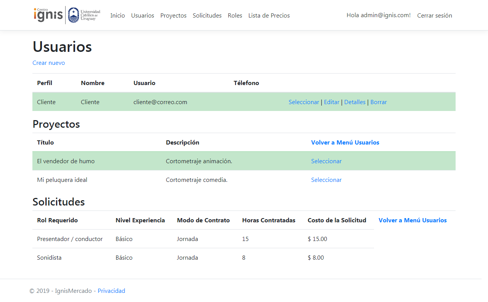
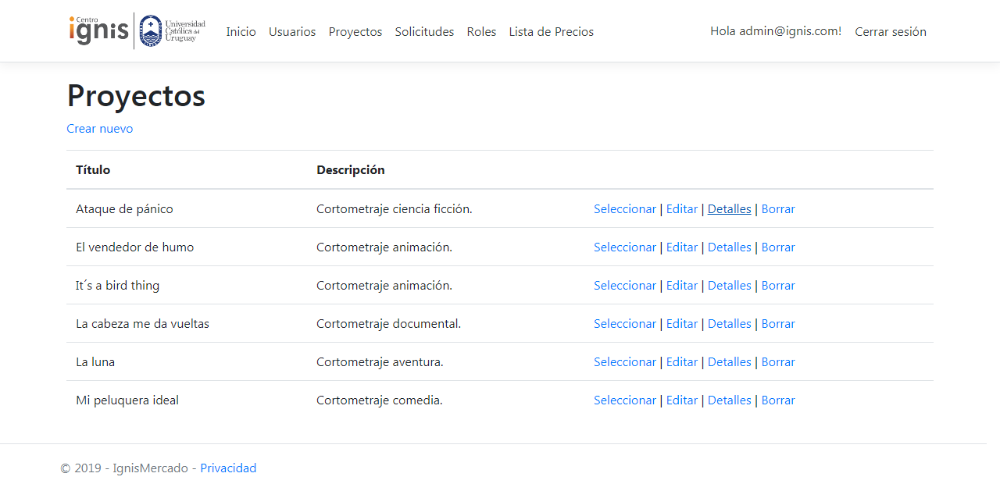

## INGRESO AL SITIO

## **USUARIOS DE PRUEBA**

#### Usuarios: admin@correo.com, cliente@correo.com, tecnico@correo.com

#### Contraseña para todos: Abece.123

#### Página de inicio de la aplicación.

## REGISTRARSE

#### Para registrarse en la aplicación debe seleccionar Registrarse en la esquina superior derecha. Ingresar sus datos y confirmar el registro presionando el botón.

## INGRESAR

#### Para ingresar en la aplicación debe seleccionar Ingresar en la esquina superior derecha. Ingresar su usuario y contraseña y presionar el botón Ingresar.

## MENÚ PRINCIPAL

#### El menú principal se encuentra ubicado en la barra superior. Las opciones disponibles dependen del perfil del usuario: Administrador, Cliente o Técnico.

## ADMINISTRADOR

### Menú Usuarios

#### El administrador puede ver todos los usuarios.

#### Para seleccionar un usuario, presionar la opción "Seleccionar".

Por ejemplo, seleccionamos "cliente@correo.com".

Se despliega un cuadro con los proyectos asociados a este cliente.

#### Cuando seleccionamos uno de los proyectos, se despliegan las solicitudes asociadas a este proyecto.

### Menú Proyectos

#### Esta página lista todos los proyectos del centro, seleccionando un proyectos podemos ver todas sus solicitudes.

### Menú Solicitudes

#### Esta página lista todas las solicitudes ingresadas. Seleccionando una veremos los técnicos asignados a esta solicitud y los técnicos disponibles.

#### Desasignar un técnico: presionamos el botón "Desasignar", se elimina de la lista y pasa a Técnicos disponibles.

#### Asignar un técnico: presionamos el botón "Asignar", se elimina de la lista y pasa a Técnicos Asignados.

### Menú Roles

#### En esta página podemos crear, editar y eliminar los roles de trabajo de los técnicos.

### Menú Lista de Precios

#### En esta página podemos modificar los precios.

## CLIENTE

#### El cliente solo puede ver información asociada a su usuario. Puede modificar su propia información personal.

#### Proyectos y Solicitudes: puede crear un proyecto, modificar uno existente y ver las solicitudes asociadas a ese proyecto.

#### No puede eliminar solicitudes que haya creado. Solo el administrador puede hacer esa tarea.

#### Lista de Precios: solo puede acceder a información de la lista, no puede modificarla.

## TÉCNICO

#### Al igual que el cliente, el técnico solo puede acceder a información asociada a su usuario.

