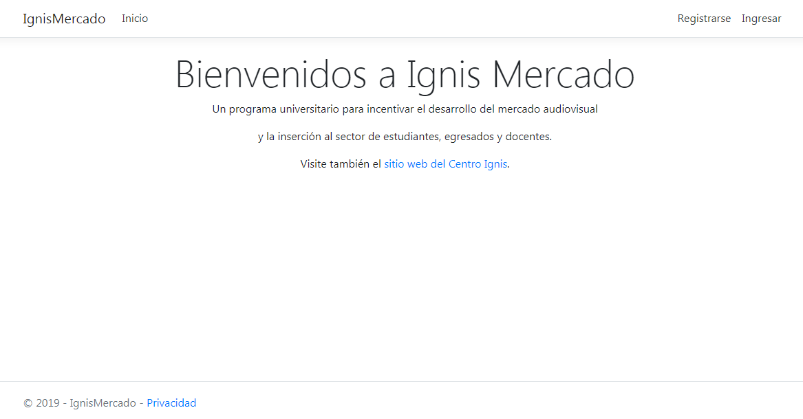
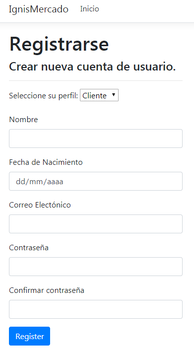
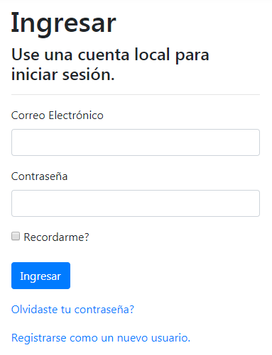
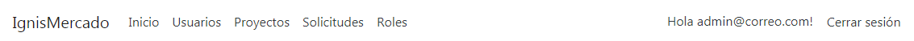

# PROGRAMACIÓN 2 - 2019

### EQUIPO 5 : Sofía, Fausto, Matías, Marcelo.

## **USUARIOS DE PRUEBA**

#### Usuarios: admin@correo.com, cliente@correo.com, tecnico@correo.com

#### Contraseña para todos: Abece.123

## **PANTALLA PRINCIPAL DEL SITIO**

## **REGISTRAR UN NUEVO USUARIO**

#### En la pantalla principal del sitio, presionar la opción "Registrarse".

#### Deberá ingresar sus datos personales, correo electrónico (este será su nombre de usuario) y una contraseña.

#### Deberá seleccionar su perfil: Administrador, Cliente o Técnico. Esta opción define los menús de la aplicación a los cuales tendrá acceso y las acciones que podrá realizar.

## **INGRESAR A LA APLICACIÓN**

#### En la pantalla principal del sitio, presionar la opción "Registrarse".

#### Para ingresar a la aplicación debe ingresar su usuario (correo electrónico) y su contraseña.

#### Solo los usuarios previamente registrados pueden ingresar a la aplicación.

## **OPCIONES DEL MENÚ**

#### Las opciones disponibles en el menú superior varian de acuerdo al perfil de usuario.

#### Los administradores pueden ver todas las opciones.

#### Los clientes y técnicos solo pueden ver las opciones relevantes a sus tareas.

## **MODIFICAR SUS DATOS PERSONALES**

#### Para modificar sus datos personales debe ingresar a la aplicación y presionar su nombre de usuario en la esquina superior derecha.

## 
#### 
#### 
#### 

